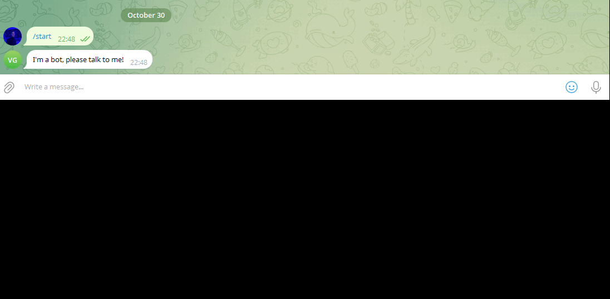

# Чат-бот для telegram и Вконтакте на основе умного бота DialogFlow
Репозиторий соедержит скрипты для запуска чат бота telegram и Вконтакте, а также вспмогательные скрипты для настройки и подключения бота DialogFlow.
Представленные чат-боты взаимодействую с DialogFlow, распознают сообщения пользователя и отвечают пользователю, отет зависит от того, какими фразами было обучена нейросеть DialoGflow.



## Как установить

Для запуска чат ботов сначала необходимо выполнить следующие действия

### Создать проект в DialogFlow

* Создать Google проект по [ссылке](https://docs.cloud.google.com/dialogflow/es/docs/quick/setup#project)
* Включить [API](https://docs.cloud.google.com/dialogflow/es/docs/quick/setup#api)
* Создать DialogFlow [агента](https://docs.cloud.google.com/dialogflow/es/docs/quick/build-agent#create-an-agent)
ВНИМАНИЕ! При создании агента укажите для него русский язык, а также проверьте что в настройках агента указа Project ID ранее созданного Google проекта. Если Id прокта не совпадает пересоздать агента.
* Создайте тестовый intent, добавтье ему Training phrases и укажите ответ который он должен давать Response
* Проверьте, что бот вам отвечает (Проверить в правом углу, написать фразу, указанную в Training phrases и посмотреть, что он отвечает нужным сообщением из Response)
* Установить google cloud CLI командой или через дистрибутив по [ссылке](https://cloud.google.com/sdk/docs/install#installation_instructions)
* Обновить  google cloud CLI в консоли google cloud CLI [командой](https://cloud.google.com/sdk/docs/install#manage_an_installation):
```sh
gcloud components update
```
* Инициализировать Google Cloud CLI [командой](https://cloud.google.com/dialogflow/es/docs/quick/setup#sdk):
```sh
gcloud init
```
* Создать пользовательские [credentials.json](https://cloud.google.com/dialogflow/es/docs/quick/setup#rest-command-line-user-account-authentication) командами:
```sh
gcloud auth login
gcloud auth application-default login
gcloud auth application-default set-quota-project ID_ВАШЕГО_ПРОЕКТА
```
* Создать конфигурацию 
```sh
gcloud config set project ID_ВАШЕГО_ПРОЕКТА
```
# Создать файл с фразами для обучения бота
* В корне каталога создать файл имя_файла.json с фразами для обучения бота. Пример файла находится в репозитории `training phrases.json`.
Имя словаря - название intentа, question - вопрос пользователя боту, answer - ответ бота пользователю.

# Задать переменные окружения
* В корневом каталоге проекта создать файл .env следующего содержания
```sh
TELEGRAM_CHAT_ID = 'CHAT ID телеграмм бота'
GOOGLE_APPLICATION_CREDENTIALS= путь до файла credentials.json, например если файл лежит в корневом каталоге проекта, то путь .\application_default_credentials.json
Project_ID = "Project ID Google проекта"
TELEGRAM_BOT_TOKEN = 'Токен Телеграмм Бота'
VK_API_KEY = 'API токен группы телеграмм где будет отвечать бот, получается в настройках сообщества'
TRAINING_PHRASES = 'Имя файла с фразами для обучения бота DialogFlow'
```

###  Как запустить

* Для запуска сайта понадобится python версии 3 (проект разрабатывался на версии python 3.10.11)

* Скачайте код с Githib

* Установите переменное окружение

```sh
python -m venv venv
```

* Активируйте переменное окружение

linux
```sh
source venv/bin/activate
```

* Windows
```sh
./venv/Scripts/activate
```

* Установите зависимости

```sh
pip install -r requirements.txt
```

* Обучите бота запустив скрипт `educate_dialogflow_bot.py`
```sh
python ./educate_dialogflow_bot.py
```

* Перейдите на страницу intentов DialogFlow и убедитесь, что intentы были добавлены

* Запустите скрипт `vk_bot.py` для запуска бота Вконтакте:
```sh
python ./vk_bot.py
```
* Запустите скрипт `tg_bot.py` для запуска бота Телеграмм:
```sh
python ./tg_bot.py
```

###  Цели проекта

Код написан в учебных целях — это урок в курсе по Python и веб-разработке на сайте [Devman](https://dvmn.org).


